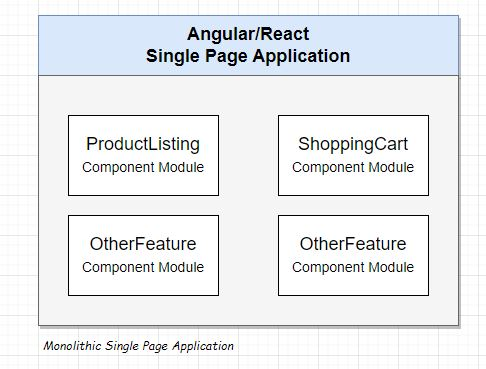
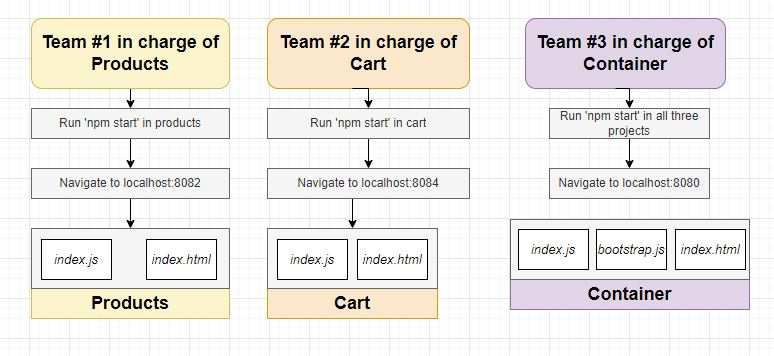
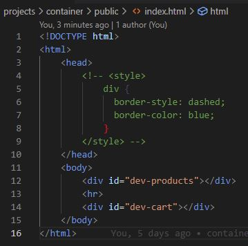

# mfe-simple
no frameworks, just simple javascript and webpack module federation

# Projects

Lets build 3 seperate teams, 3 seperate projects

## /products
// https://fakerjs.dev/api/

npm install webpack@5.4.0 webpack-cli@4.2.0 webpack-dev-server@3.11.0 faker@5.1.0 html-webpack-plugin@4.5.0

but how to keep them at this level?

npm run start

> products@1.0.0 start

> webpack

Node.js v18.12.1

Open and run, check your broswer at 8082, from this sample

--------------------------------
## /container
npm install webpack@5.68.0 webpack-cli@4.10.0 webpack-dev-server@4.7.4 html-webpack-plugin@5.5.0 nodemon

Open and run, check your broswer at 8080, from this sample

## /cart

Open and run, check your broswer at 8084, from this sample

Next Starting point, Step 21
